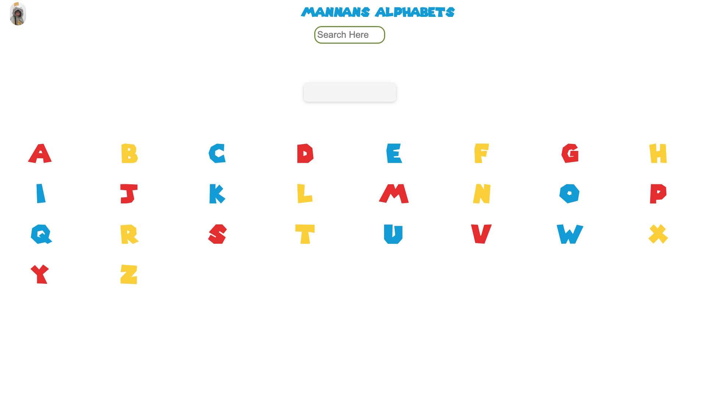

# Phonics/Alphabet Tool



The Phonics/Alphabet Tool is a web-based application designed to help kids learn phonics and the alphabet in a fun and interactive way. It provides a set of alphabet buttons that, when clicked, play the corresponding phonetic sound of the letter. The tool is ideal for educators, tutors, and parents who want to engage kids in learning the alphabet.

## Features

- Interactive alphabet buttons with phonetic sounds
- Clicking on a letter button plays the corresponding phonetic sound
- Text input allows users to enter letters and hear their phonetic sounds
- Fun and engaging way for kids to learn phonics and the alphabet
- Easy to use and visually appealing user interface

## Demo

You can try out the Phonics/Alphabet Tool by visiting [Demo Link](https://keen-heliotrope-06a1d4.netlify.app).

## Installation

1. Clone this repository:
```
git clone https://github.com/mujtabach2/abc.git
```
3. Open the `index.html` file in your web browser.

## Usage

1. Click on a letter button to hear its phonetic sound.
2. Type a letter or word in the input box and press enter to hear its phonetic sound and how the word is put together.
